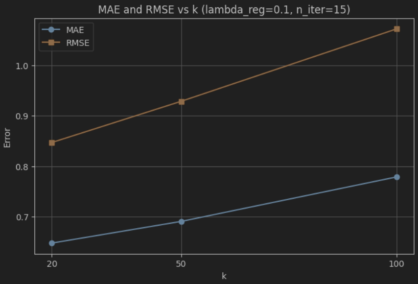
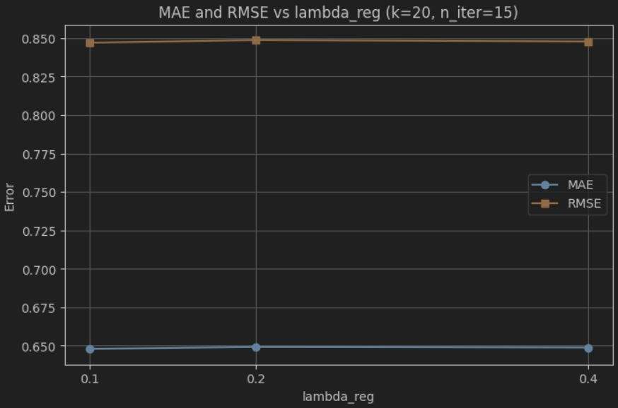
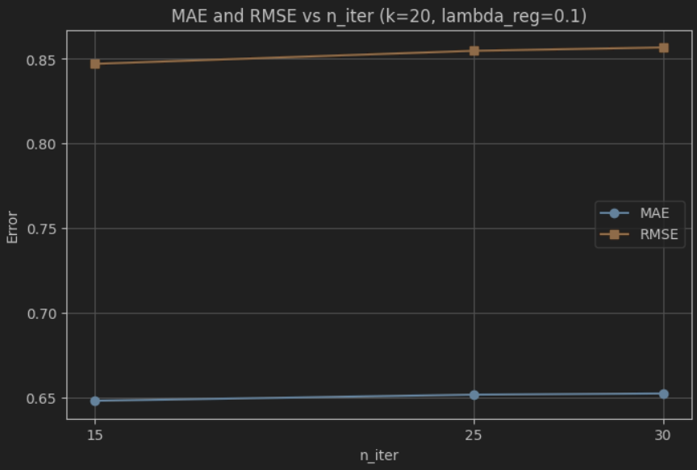

# Recommendation System using ALS-Based Collaborative Filtering

## Setup
- Download dataset from: https://www.kaggle.com/datasets/netflix-inc/netflix-prize-data
- Unzip it in folder `data/`
- Run `preprocessing.ipynb` and the data will be exported to `data/processed/`. This step combines data from multiple `.txt` files into a single dataframe and divides it randomly into a train and test set with a 90%/10% split. It also ensures that all user IDs and movie IDs in the test set exist in the training set.

## ALS Model and Evaluation
I implemented the Alternating Least Squares (ALS) algorithm from scratch using NumPy and SciPy's sparse matrices. The script runs hyperparameter tuning across different latent features, iterations, and regularization terms, calculating MAE and RMSE for each combination. Finally, it uses Matplotlib to plot the error trends and help pick the best model.

### ALS Algorithm Overview
The ALS algorithm solves the optimization problem iteratively by alternating between updating user factors and item factors.

**Optimization problem:**

$$
\min_{U,V} \sum_{(u,i) \in observed} (R_{ui} - U_u \cdot V_i^\top)^2 + \lambda(||U_u||^2 + ||V_i||^2)
$$

**1. Fix Item Factors and Optimize User Factors:**
For each user (u), update (U) to minimize error for observed ratings while keeping (V) fixed:

$$
U_u = (V_u^\top V_u + \lambda I)^{-1} V_u^\top R_u
$$

**2. Fix User Factors and Optimize Item Factors:**
For each item (i), update (V) to minimize error for observed ratings while keeping (U) fixed:

$$
V_i = (U_i^\top U_i + \lambda I)^{-1} U_i^\top R_i
$$

Finally, the predicted rating for user (u) and item (i) is calculated as:

$$
\hat{R}_{ui} = U_u \cdot V_i^\top
$$

## Hyperparameter Tuning Results
We tested different combinations of hyperparameters to evaluate model performance on the test set:
* **Number of latent factors**: 20, 50, 100
* **Regularization parameter (lambda)**: 0.1, 0.2, 0.4
* **Number of ALS iterations**: 15, 25, 30

### Latent Factors
The number of latent factors is the most significant hyperparameter. Increasing the number of factors leads to higher error. For large numbers of factors (e.g., 100), the error exceeds 1.

### Regularization Parameter
For the regularization parameter (lambda), the lowest error was achieved at 0.1.

### Iterations
Regarding the number of iterations, increasing iterations also leads to slightly higher error.

